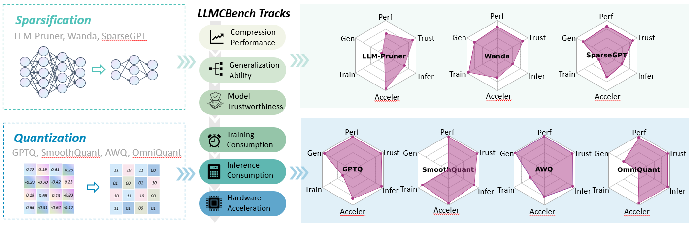

# LLMCBench: Benchmarking Large Language Model Compression for Efficient Deployment



## Installation

```
git clone https://github.com/AboveParadise/LLMCBench.git
cd LLMCBench

conda create -n llmcbench python=3.9
conda activate llmcbench

pip install -r requirements.txt
```

​    

## Example

This repo contains codes for testing MMLU, MNLI, QNLI, Wikitext2, advGLUE, TruthfulQA datasets and FLOPs.

#### Testing MMLU

```
bash scripts/run_mmlu.sh
```

#### Testing MNLI

```
bash scripts/run_mnli.sh
```


## Acknowledgements

In addition to the code in this repo, we also use [EleutherAI/lm-evaluation-harness: A framework for few-shot evaluation of language models. (github.com)](https://github.com/EleutherAI/lm-evaluation-harness) for evaluation.

## Citation
